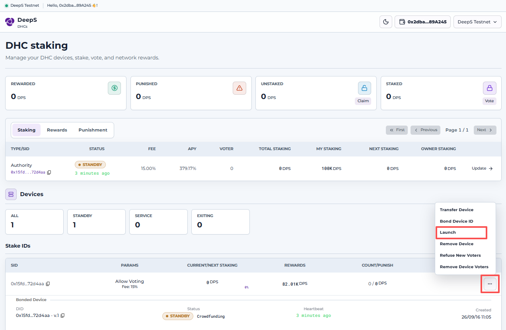
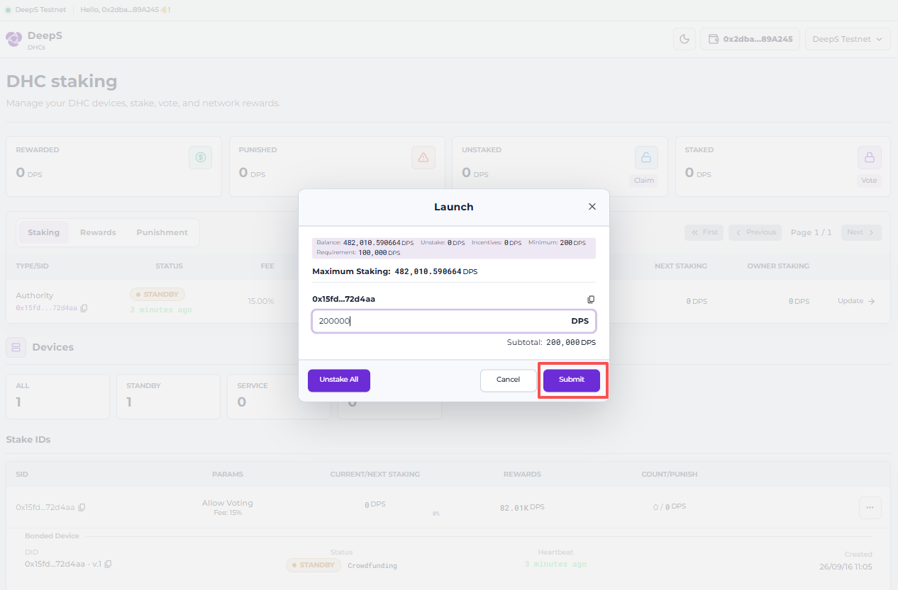
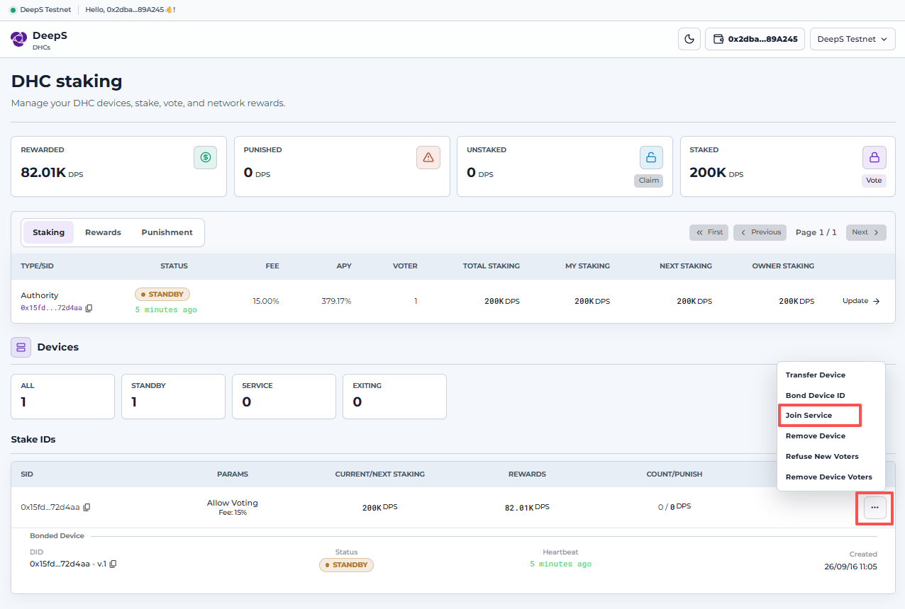
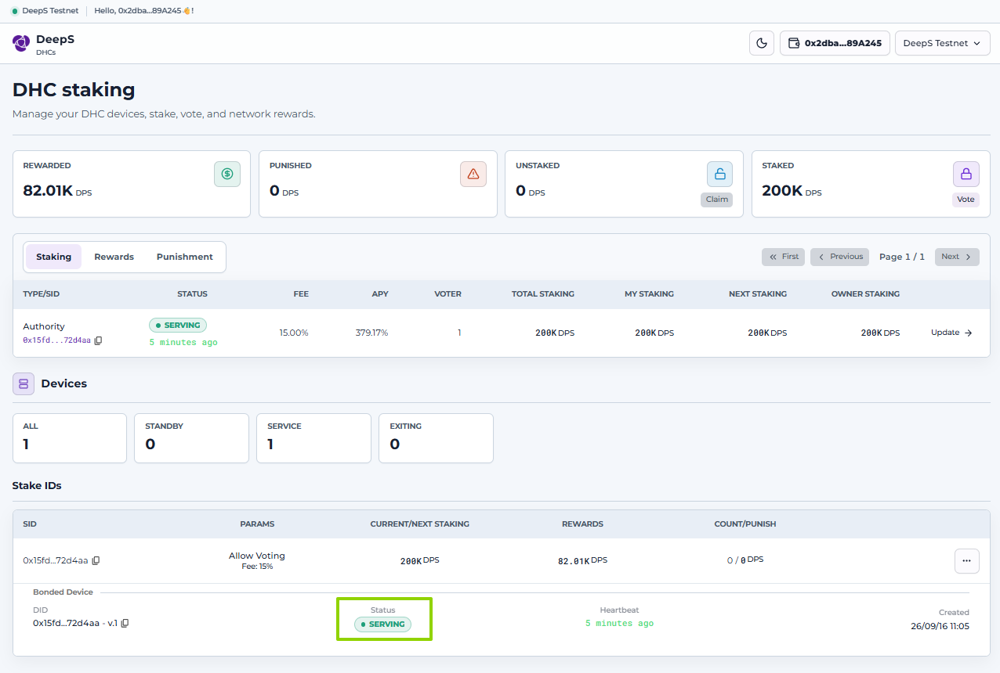
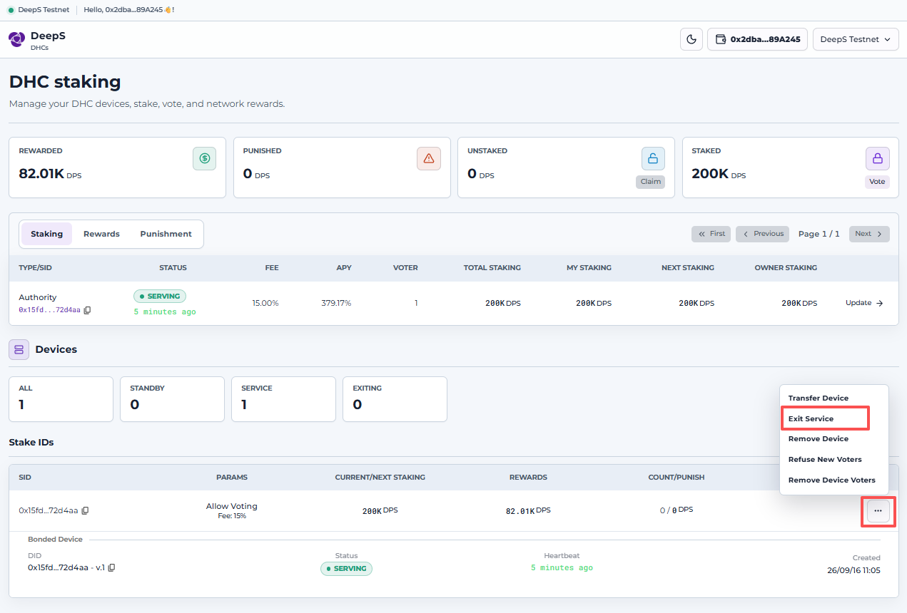

# Mining Guidance

- [Mining Guidance](#mining-guidance)
  - [Instructions](#instructions)
  - [SGX](#sgx)
  - [Running the Service](#running-the-service)
    - [Preparing an Account](#preparing-an-account)
      - [Option 1](#option-1)
      - [Option 2](#option-2)
    - [Preparing Tokens](#preparing-tokens)
    - [Configuration Modification](#configuration-modification)
    - [Startup and Maintenance](#startup-and-maintenance)
      - [Update Device](#update-device)
      - [Exiting the Service (if required)](#exiting-the-service-if-required)
  - [FAQ](#faq)

## Instructions

Before starting, please cofirm on [Intel© Ark](https://ark.intel.com/content/www/us/en/ark.html#@Processors) whether your processor is compatible with [Intel© SGX](https://www.intel.com/content/www/us/en/developer/tools/software-guard-extensions/overview.html).

Then clone the repository:

```bash
git clone https://github.com/deepslabs/deeps-mining-scripts.git
```

## SGX

Inspect your system's SGX support with:

```shell
sudo ./sgx-detect
```

Install the packages required to build the SGX driver:

```shell
sudo apt update
sudo apt install build-essential automake autoconf libtool wget python3 libssl-dev dkms
```

Sample output:

```text
✔  SGX instruction set
  ✔  CPU support
  ✔  CPU configuration
  ✔  Enclave attributes
  ✔  Enclave Page Cache
  SGX features
    ✔  SGX2  ✔  EXINFO  ✘  ENCLV  ✘  OVERSUB  ✔  KSS
    Total EPC size: 16.0GiB
✔  Flexible launch control
  ✔  CPU support
  ？ CPU configuration
  ✔  Able to launch production mode enclave
✔  SGX system software
  ✔  SGX kernel device (/dev/sgx_enclave)
  ✘  libsgx_enclave_common
  ✘  AESM service
  ✔  Able to launch enclaves
    ✔  Debug mode
    ✔  Production mode
    ✔  Production mode (Intel whitelisted)
```

If it displays as `✘ SGX kernel device (/dev/sgx_enclave)`, We should install SGX Environment and restart with:

```shell
sudo chmod +x sgx_enable
sudo ./sgx_enable
sudo reboot
```

## Running the Service

Once you have confirmed that your machine supports SGX2, you can launch the keyring service. The keyring service obtains events and state from a node service. In the configuration file, it is advisable to use an official node as the data source. Alternatively, you can start a local full node and use it as the data source once synchronization is complete.

### Preparing an Account

Before starting the service, you must create an account to serve as the owner responsible for holding and managing the keyring service.

#### Option 1

Generate an account using the command `docker run -it --rm deepslabs/deeps-node:pre-beta identity generate`.

You will receive an output like this:

```text
Secret seed:      0x71235e1458ce9d140c8b8ded28ccc1e32e62c340aef51a65e1350a387dbe08a6
Public key (hex): 0x0248e7f02dcc9f7061a090b67dede93d7381847e94955aee7996603d2225e9f77e
Account ID:       0x34a5572cb21d34354e3091564d5edc7b791e9d5f
```

`Secret seed` is the account's private key, which can be imported directly into wallets such as MetaMask.
`Account ID` is the account's address.

#### Option 2

Alternatively, you can create an account with MetaMask, because the DeepS account system is Ethereum-compatible.

We recommend MetaMask here, since subsequent operations require interaction with the [DHC dashboard](https://test-dhcs.deeps.fi/testnet).

### Preparing Tokens

Fund your address with some tDPS so that the device can be deployed.

### Configuration Modification

For most users, simply replace `device_owner` in the default configuration file with the `Account ID` created in the previous step. No other parameters need to be modified.

For example, open the `keyring.toml` file under the `configs` directory and replace `0x00000000000000000000000000000000000000` with your `<Account ID>`.

Run `./dhc config -n <network>` to generate the default configuration file. It covers identity information, service ports, the P2P network, the service launch type, and so on, as shown below:

```toml
node_ws_url = "ws://127.0.0.1:9944"
# local node_call server port.
node_call_port = 8720
# the owner address of the device (ETH format)
device_owner = "0x00000000000000000000000000000000000000"
# database path
db_path = "/host/data"
# tokio console port
console_port = 5555

# database start option
[db_option]
create_if_missing = true
atomic_flush = true

[prime_factory_config]
threads = 5
target = 500

[network_config]
protocol_id = "betamainnet"
port = 38700
boot_nodes =["/ip4/172.210.130.200/tcp/38701/p2p/12D3KooWQBrkBWb3tLoUpxqXebxg1Eab24LfcFP3hv37ZF2c6qgz","/ip4/20.81.161.179/tcp/38701/p2p/12D3KooWMDqap7HMjA6nos1HpHpWt8JBcPepnZgYSd5PPmovAqD7"]
share_peer_interval = 30
is_mdns = true
is_autonat = true
only_global_ips = true
#max_peers_connected = 50
#peer_key = "0x0000000000000000000000000000000000000000000000000000000000011111"
#external_multiaddrs = ["/ip4/127.0.0.1/tcp/38700"]

[key_server_config]
attestation_style = 2 # This corresponds to using an image: epid=1, dcap=2
seal_policy = "MRENCLAVE"
exe_policy = { Multiply = { executors = 8 } }
round_time_limit = 180
clear_msg_interval = 360
```

Parameter descriptions:

- **`node_ws_url`**: The accessible endpoint of the node service. For a local node, this is usually `ws://127.0.0.1:9944`.

- **`node_call_port`**: The port on which the keyring service is exposed to the outside world.

- **`device_owner`**: The owner of the keyring service. This is a crucial factor affecting the income and penalties for providing services.

- **`db_path`**: The path where the keyring service persists its data. Modifying it is not recommended. If you do need to change it, refer to the [Occlum file system](https://occlum.readthedocs.io/en/latest/filesystem/fs_overview.html).

- **`db_option.create_if_missing`**: Runtime parameter of the RocksDB database exposed by the keyring service.

- **`db_option.atomic_flush`**: Runtime parameter of the RocksDB database exposed by the keyring service.

- **`prime_factory_config.threads`**: The number of threads occupied when a new version is launched. Each version is initialized and called once, occupying CPU for a period of time. To avoid occupying all CPUs, adjust this value as appropriate (by default, all threads are occupied).

- **`prime_factory_config.target`**: The target number of safe primes to generate. During actual operation it should be slightly larger, preferably between 100 and 1000. The larger the number, the longer the initialization time (default value: 500).

- **`network_config.protocol_id`**: The P2P network protocol identifier, which is particularly important. Different networks use different `protocol_id` values. Follow the official configuration, otherwise the link will be invalid.

- **`network_config.port`**: The local port for the keyring service's P2P communication.

- **`network_config.is_mdns`**: Whether mDNS discovery is enabled.

- **`network_config.is_autonat`**: Whether AutoNAT discovery is enabled.

- **`network_config.max_peers_connected`**: The maximum number of nodes allowed to connect.

- **`network_config.boot_nodes`**: The peers that the keyring service's P2P module connects to. If misconfigured, the node becomes isolated and cannot participate in the service.

- **`network_config.share_peer_interval`**: The interval at which the keyring service's P2P module reports the number of connected nodes.

- **`network_config.only_global_ips`**: Whether the keyring service's P2P module manages only public IP addresses.

- **`network_config.peer_key`**: The keyring service's P2P identity key. If left empty, it is generated randomly.

- **`key_server_config.attestation_style`**: The SGX remote attestation mode of the keyring service, where `1` is `EPID` and `2` is `DCAP`.

- **`key_server_config.seal_policy`**: The data encryption method of the keyring service, supporting `MRSIGNER` and `MRENCLAVE`. It has the same meaning as [Intel SGX sealing](https://www.intel.com/content/www/us/en/developer/articles/technical/introduction-to-intel-sgx-sealing.html). `MRSIGNER` trusts the software publisher, and its advantage is that data remains readable after a software upgrade. `MRENCLAVE` trusts only the code, and its disadvantage is that historical data cannot be read after a software upgrade.

- **`key_server_config.exe_policy`**: An optional execution engine that affects software execution efficiency. It generally does not need to be changed.

- **`key_server_config.round_time_limit`**: The waiting time, in seconds, for data exchange between keyring services. The session ends if the waiting time is exceeded.

- **`key_server_config.clear_msg_interval`**: The interval, in seconds, at which the keyring service clears abnormal data.

We use Docker Compose to manage the service. If you need to specify a storage directory, modify the disk mapping in the `docker-compose.yml` file to `./data`. By default, the keyring service's data is stored in the same directory as the `docker-compose.yml` file.

```yaml
volumes:
    - ./configs:/configs
    - ./data:/root/occlum_instance/data
```

Note: `/root/occlum_instance/data` is an internal directory within Occlum and does not need to be modified.

### Startup and Maintenance

Before starting, check whether `docker compose` is installed. You can verify this by running `docker compose --version` or `docker-compose --version`. If it is not installed, install it:

```shell
# install docker-compose
sudo curl -L "https://github.com/docker/compose/releases/download/1.29.2/docker-compose-$(uname -s)-$(uname -m)" -o /usr/local/bin/docker-compose
sudo chmod +x /usr/local/bin/docker-compose
docker-compose --version
```

To start the service and view its logs, use the following commands:

```shell
docker-compose up -d
docker-compose logs -f
```

Wait for the software to start. If any error occurs, consult the [FAQ](#faq).

If the software is running correctly, you will see logs similar to the following:

```text
register sgx: "0x13bec2ac21b038d885d49d8100d307ce7761cf890bbdf25962a0eb2f2ac18101"
```

Log in to [DeepS DHC](https://test-dhcs.deeps.fi/testnet) with your `device_owner` account. Unlisted devices initially appear in the device list.

**All subsequent actions require a MetaMask signature. Verify that the account connected in MetaMask matches the `device_owner` account in your `keyring.toml` file.**

#### Update Device

Go to [DeepS DHC](https://test-dhcs.deeps.fi/testnet) to activate the device. For the first time, you need to vote tokens for it.



For a quick start, stake 100000 tDPS at a time, then click the `Submit` button.



Wait for one epoch, and once the total staked amount reaches the threshold (100000 tDPS), join the service via `Join Service`.



When the device status changes to `Service`, **congratulations** 鈥?the process is complete.



> To check whether the software is running correctly, look for logs like the following:
> `HeartBeat session: 40167, challenge: [...], hash: "0xa746ff7daae0952967cc9eadb38e6627052cd073cf0a319cb8fcb65e0abdabef"`

#### Exiting the Service (if required)

Note: The system penalizes malicious nodes by deducting their staked tokens. To avoid financial losses caused by an irregular exit, follow the process below.

Exit the service by selecting `Exit Service`:



After selecting `Exit Service`, you must wait one epoch before you can select `Remove Device`. No operations are available during this period.

Finally, stop your keyring service:

```shell
docker compose down
```

## FAQ

Refer to the [troubleshooting documentation](https://docs.deeps.fi/node-operations/troubleshooting).
